# CS105_Final_Project#

This is the version control system we're using for our project. Comparing to Google CoLab we used before, this is a better place for version control, editing and comparing different modifications.

Please complete the following steps to set up your local repository.

## 1. Visual Studio Code ##

Most of you might have already heard/used this compiler before. It will save a lot of time for Github version control. Here's a brief introduction on how to install and use your visual studio to open .ipynb files.

### **Download Visual Studio Code** ###

a) Visit [https://code.visualstudio.com/](https://code.visualstudio.com/).

b) Click the Download for Windows button to download. Click the down arrow on right for more versions for different systems.

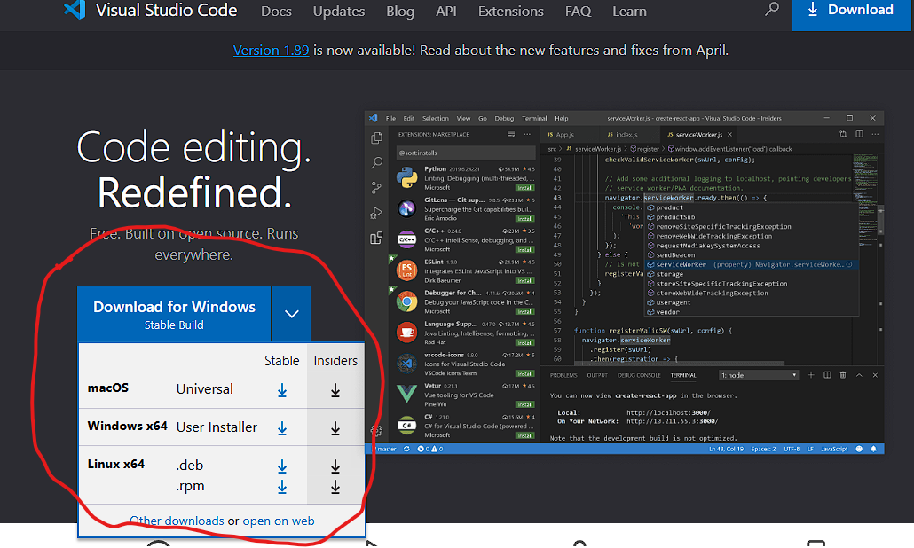

c) After finishing downloading, run the downloaded file and follow the instructions. Customize your installation as you wish.

d) After installation, you may open the VSCode and start your project!

### **VSCode file management** ###

After opening VSCode, you'll see a welcome window as below:

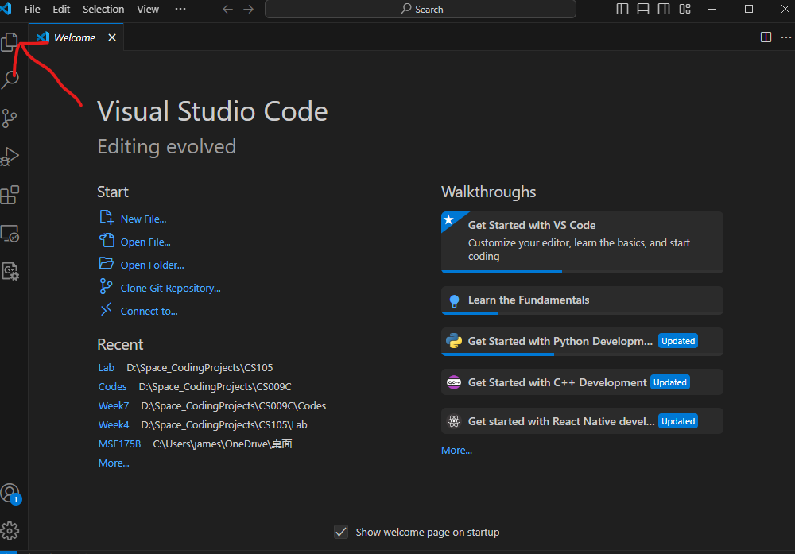

Click the arrowed icon, you'll see a file explorer. Click the "Open folder" button to browse your local files.

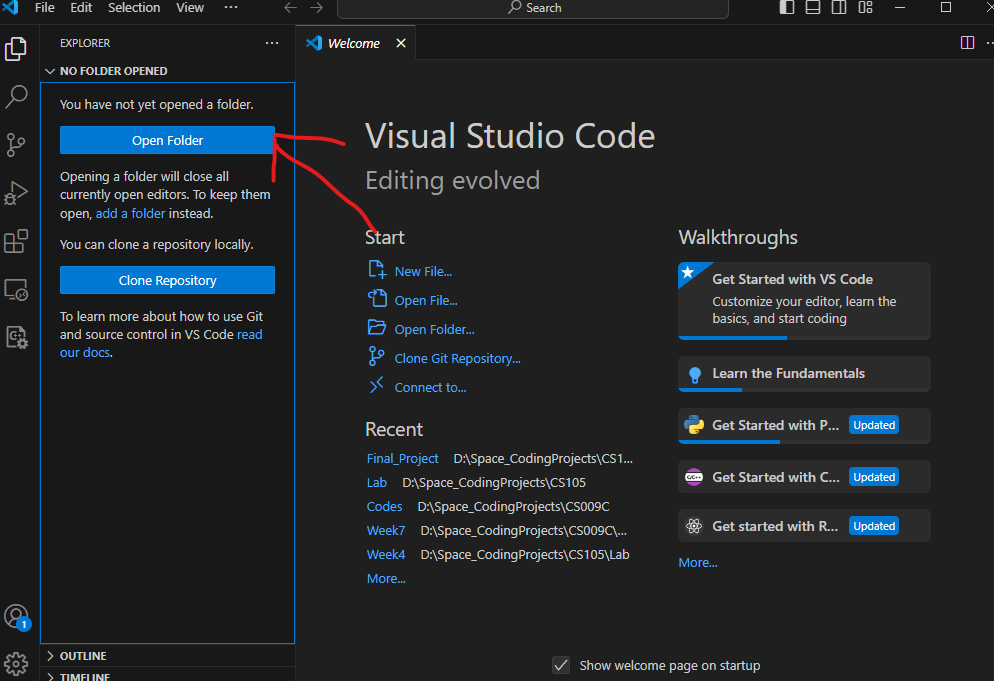

Select/create a folder that you want to store your final project in on your local machine. Use explorer to find the target folder and click "select folder".

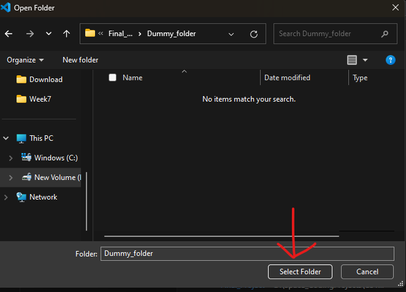

Now you should be in the target folder that you want to store your works. You shall find the folder name on the left of your VSCode, which is in the explorer. For this example, it is a folder called "dummy_folder" I created. You may name your folder whatever you like.

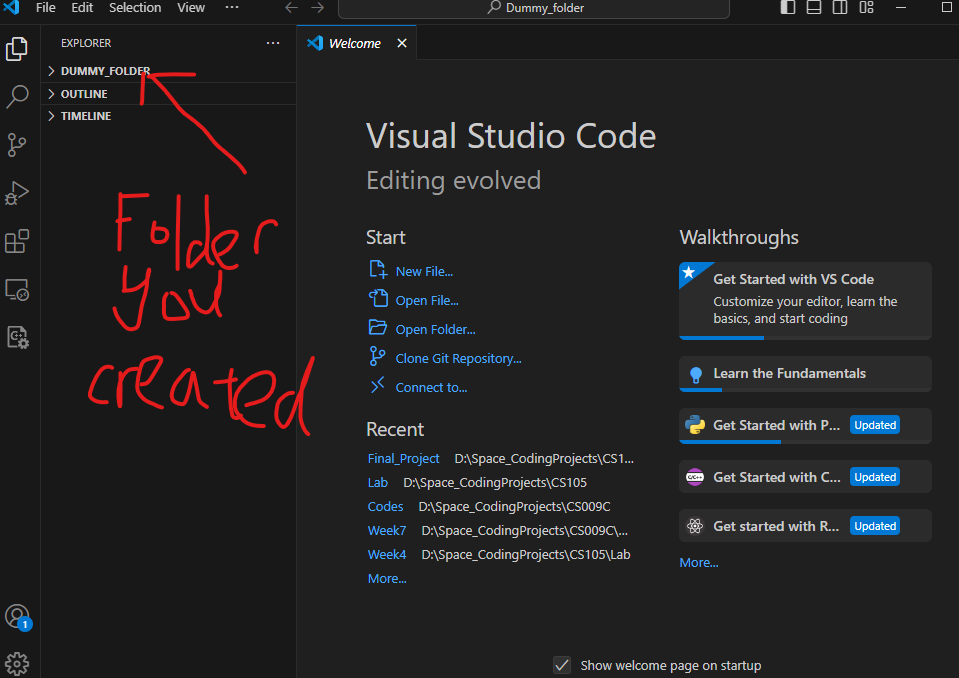

Better keep this folder clean. We will clone our GitHub repository in this folder later.

### **Download Jupyter extensions** ###

In your compiler, press `Ctrl+Shift+X` to open the extensions bar. You'll find a search bar on top of it.

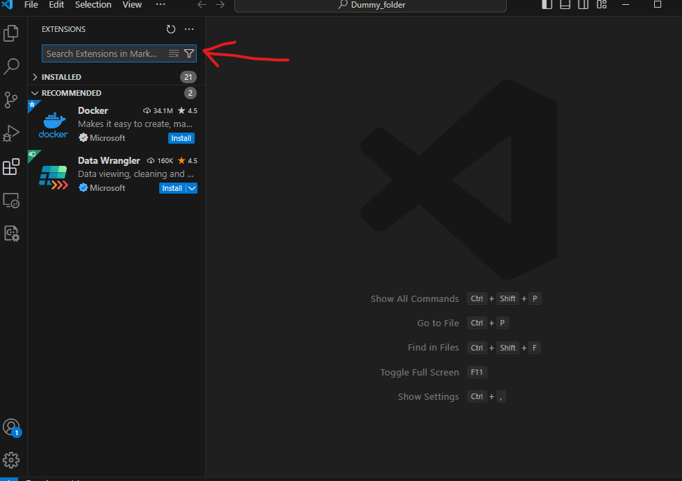

Type `Jupyter` in the search bar. Find the first extension in the list (the one with only 'Jupyter' as topic). Click 'Install' to install it.

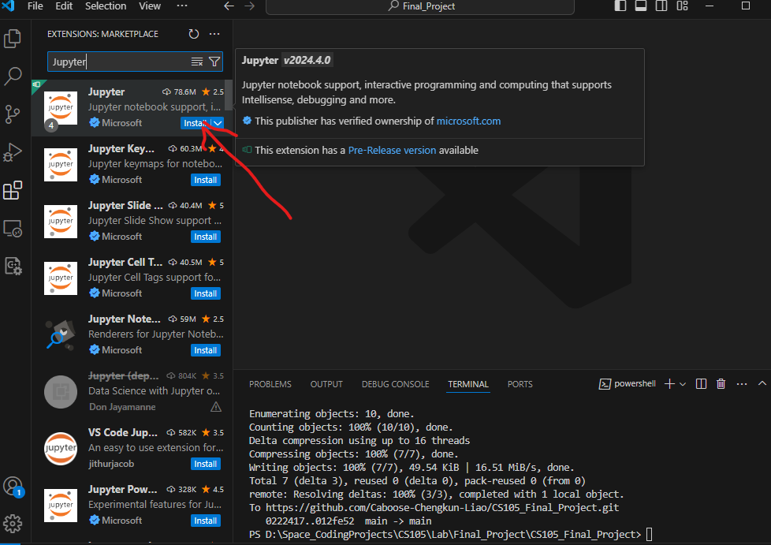

Now you're all set to edit Jupyter notebooks in your computer.

### **Terminal and direction** ###

We need some git commands to update remote/local repository. You will need to open a terminal in your window. Press `Ctrl + ~` to open terminal window. If you cannot find these keys, click View->Terminal to open the terminal on the top navigation bar.

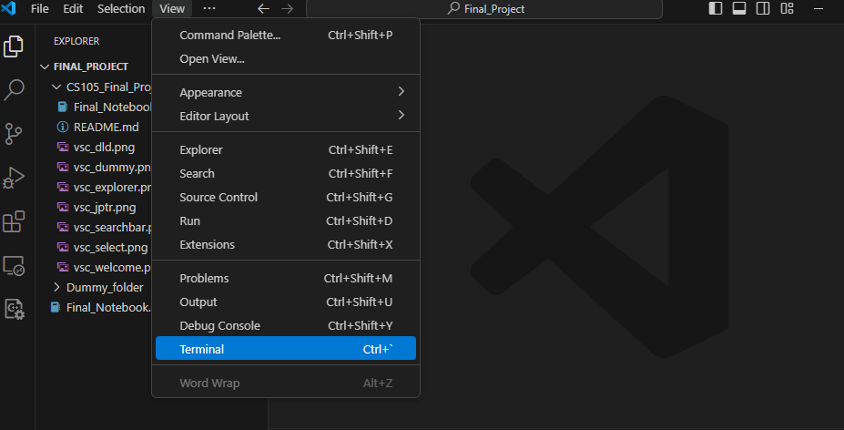

You'll find the terminal below then. Check your path on your terminal (with bunches of slashes).

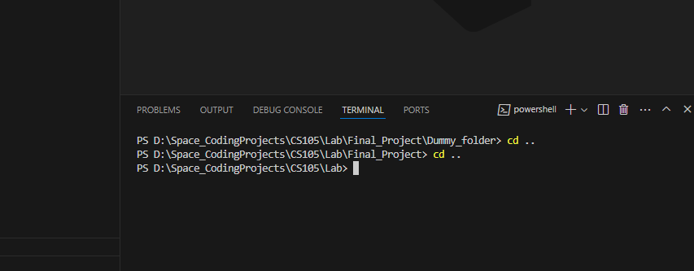

If it is not pointing to your project folder, copy the path from your local file explorer. For Windows, locate your target folder and copy the path from the path bar above.

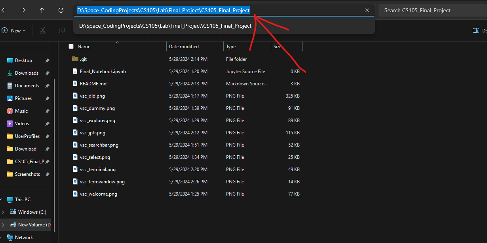

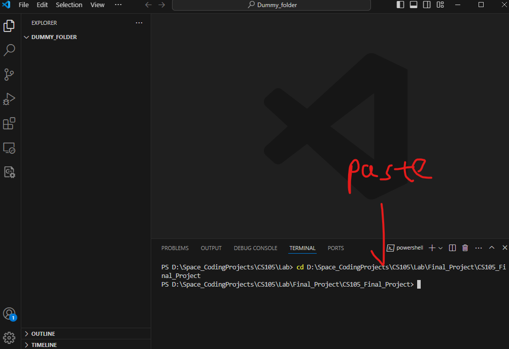

Then you shall see that your terminal location is in your project folder.

## **2. GitHub and version control** ##

You may/may not have tried GitHub for version control. But this is really handy if you can use it properly.

I'll introduce some basic features we need to use for this project.

### **GitHub repository** ##

Repository is the place we store our files. For GitHub, we have two concepts about repository: remote repository and local repository.

Remote repo is stored in GitHub server. Consider it as "Google drive" that allows people who have access to read & write contents. It also allows you to duplicate & clone the remote repo to your local machine.

However, every time you make modification on your local machine, you have to upload your work to GitHub to let others see your work. And also before starting your work, it is better to update your local repo from remote.

Now, let's talk about how to clone remote repo to your vscode, upload your work to remote server, and version control.

### **Clone a repository** ###

First, open your terminal. Make sure the path is pointing to your project folder. If not, please refer to "Terminal and direction" part to see how to change your path.

Once you have the terminal opened, type the following command to your terminal:

    git clone (Remote repo URL)

Replace the (Remote repo URL) with GitHub URL. To find the URL, you should visit the remote repo first via web browser.

Our repository will be [https://github.com/Caboose-Chengkun-Liao/CS105_Final_Project](https://github.com/Caboose-Chengkun-Liao/CS105_Final_Project). Click the link to visit the remote repository.

Once you're in the remote, click the "code" tab on the top navigation bar. Then, in the repo click the green "code" button on top-right corner.

