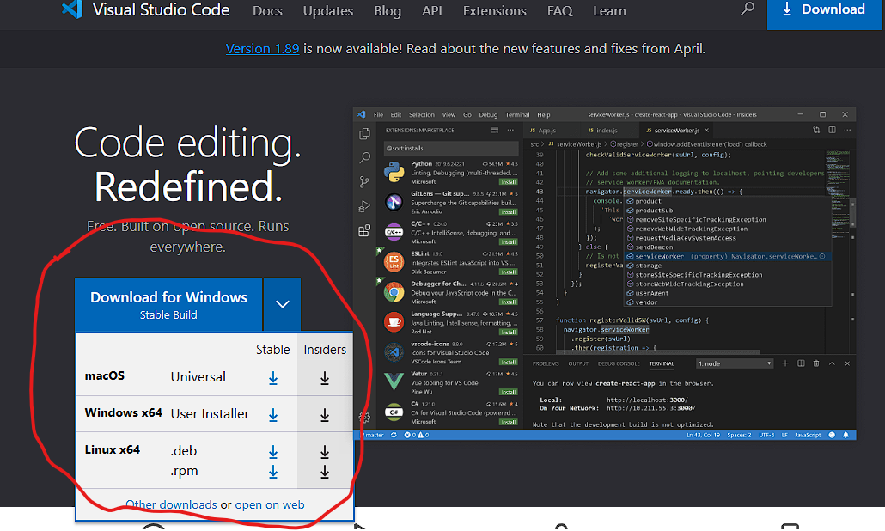
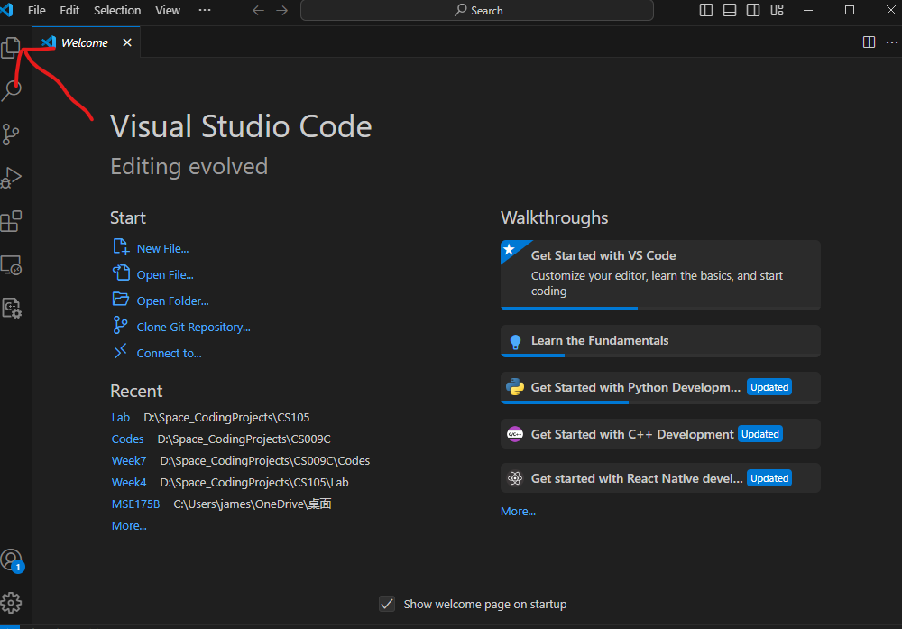
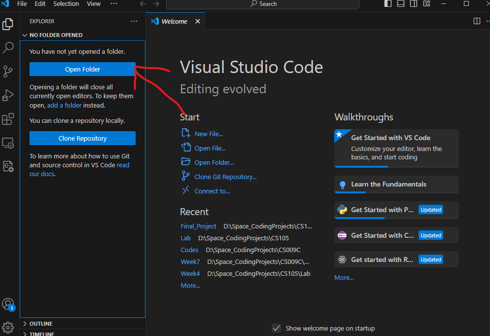
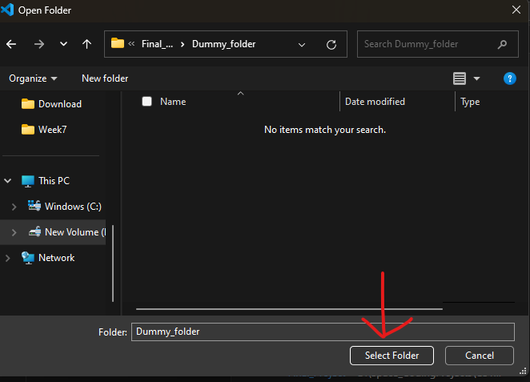
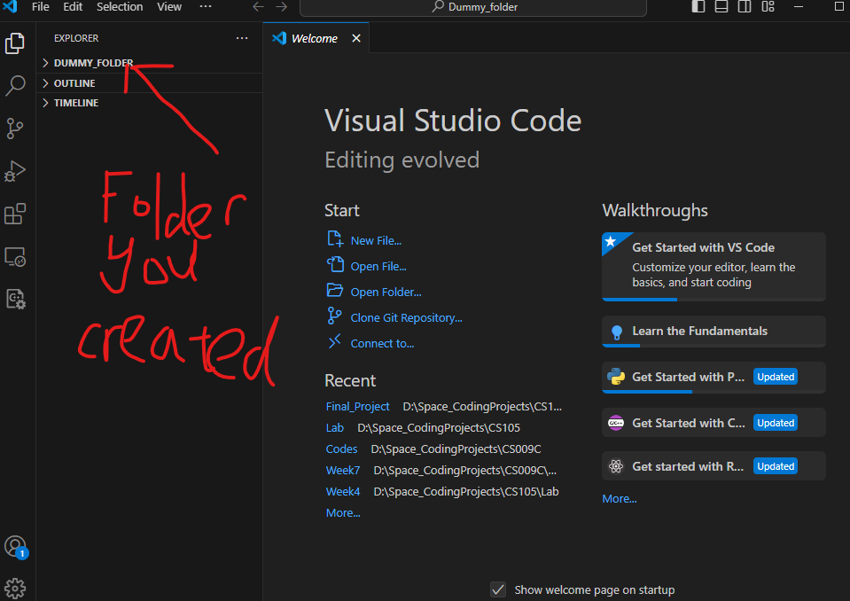

# CS105_Final_Project#

This is the version control system we're using for our project. Comparing to Google CoLab we used before, this is a better place for version control, editing and comparing different modifications.

Please complete the following steps to set up your local repository.

## 1. Visual Studio Code ##

Most of you might have already heard/used this compiler before. It will save a lot of time for Github version control. Here's a brief introduction on how to install and use your visual studio to open .ipynb files.

### **Download Visual Studio Code** ###

a) Visit [https://code.visualstudio.com/](https://code.visualstudio.com/).

b) Click the Download for Windows button to download. Click the down arrow on right for more versions for different systems.

c) After finishing downloading, run the downloaded file and follow the instructions. Customize your installation as you wish.

d) After installation, you may open the VSCode and start your project!

### **VSCode file management** ###

After opening VSCode, you'll see a welcome window as below:

Click the arrowed icon, you'll see a file explorer. Click the "Open folder" button to browse your local files.

Select/create a folder that you want to store your final project in on your local machine. Use explorer to find the target folder and click "select folder".

Now you should be in the target folder that you want to store your works. You shall find the folder name on the left of your VSCode, which is in the explorer. For this example, it is a folder called "dummy_folder" I created. You may name your folder whatever you like.

Better keep this folder clean. We will clone our GitHub repository in this folder later.

### **Download Jupyter extensions** ###

In your compiler, press ==Ctrl+Shift+X== to open the extensions bar. You'll find a search bar on top of it.
